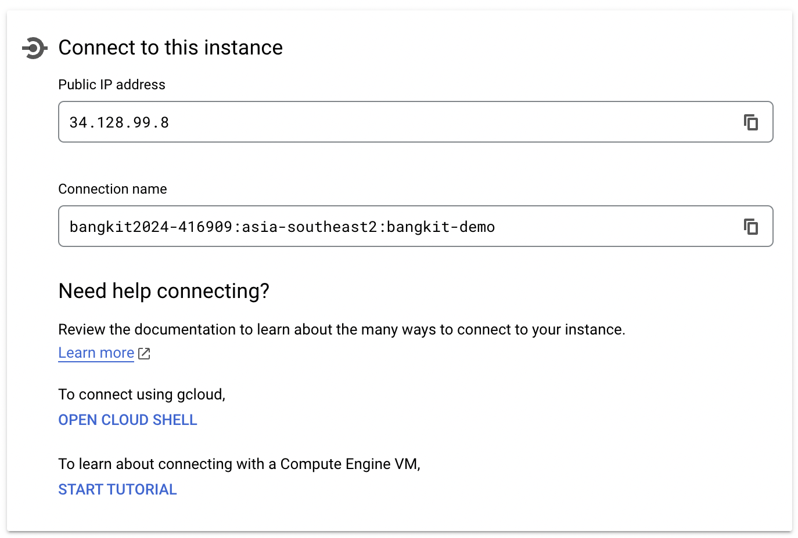
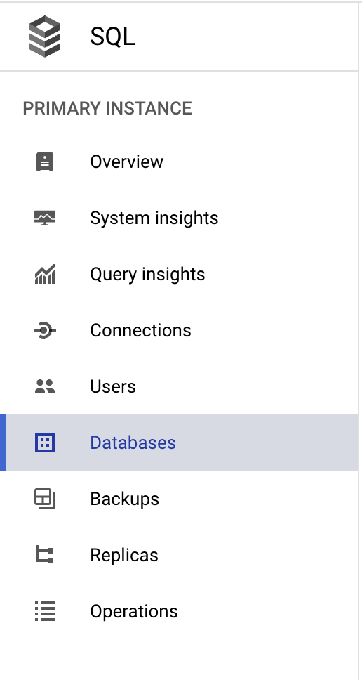
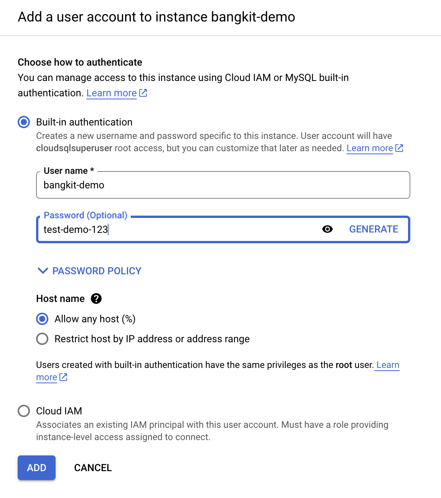

# dokterai_backend

 ## How To Run
 1. Create SQL instance in GCP
    1. Create User Table
    2. Note the instance connection name, db-name, db-user, and db-password
2. In `deploy.sh` change below variable into your own configuration:
   1. GOOGLE_PROJECT_ID -> your google project id
   2. CLOUD_RUN_SERVICE -> this will be the name of your cloud run app, you can name it whatever you like
   3. INSTANCE_CONNECTION_NAME: see `Create SQL Instance`
   4. DB_USER: see `Create SQL Instance`
   5. DB_PASS: see `Create SQL Instance`
   6. DB_NAME: see `Create SQL Instance`
3. Run `sh deploy.sh` in your terminal

## Create SQL Instance and Fill The Credentials to deploy.sh file
1. Search SQL in GCP
2. Create Instance, choose MySQL
3. In the `Overview` page, you will see connection tab, put `Connection name` to `INSTANCE_CONNECTION_NAME` in your `deploy.sh` 
4. Go to `Databases` menu, create your own database, you may choose whatever name you like. Put your database name into `DB_NAME` in your `deploy.sh`  
5. Go to `Users` menu, create your user credentials 
6. Put your user-name and password into `DB_USER` and `DB_PASS` in `deploy.sh`

Please reach me out on [linkedin](https://www.linkedin.com/in/abyanahmad/) or [email](mailto:abyanhmd2@gmail.com) if you have any inquiries.
